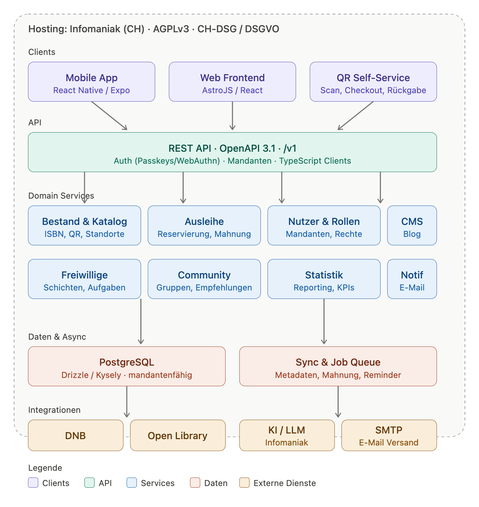
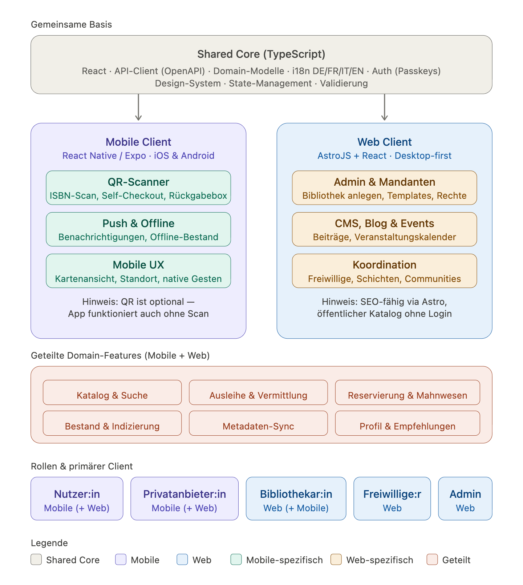

# Systemarchitektur Regalini

[toc]

---

**Version:** 1.0 **Status:** Entwurf 

**Weitere Dokumente: ** [umsetzung.md](umsetzung.md) //  [anforderungen.md](anforderungen.md)

---

## Skizze Gesamtarchitektur

 

## 

## Client-Strategie

**Ein Code, zwei Oberflächen.** Die Idee ist eine möglichst grosse gemeinsame Codebasis, damit Domain-Logik nur einmal existiert und beide Clients konsistent bleiben.

### Shared Core

Eine TypeScript-Bibliothek (Monorepo, z. B. pnpm + Turborepo) bündelt alles, was kein Client allein wissen muss:  Erstens React-Komponenten für Domain-UI, die in React Native via `react-native-web`/Tamagui- oder Gluestack-Strategie auch auf dem Web laufen; Zweitens API-Client (automatisch aus OpenAPI 3.1); Drittens Domain-Modelle, Validierung, State-Management und viertens Weiteres wie Auth-Flows, i18n (DE/FR/IT/EN) und das Design-System.

### Mobile Client (React Native / Expo)

Primär für **Nutzer:innen** und **Privatanbieter:innen**. Funktionen z.B. Suche, Reservieren, Profil, Empfehlungen, Karten. Mobile-spezifisch sind ausserdem Push-Benachrichtigungen, Offline-Bestandsansicht und Standort/Karte, QR-Scanner für 24/7 Self-Service.

### Web Client (Astro + React)

Primär für die **administrativen und kuratierenden Rollen** — **Admin, Bibliothekar:in, Freiwillige:r**. Hier ist Ausleihfunktionalität (inkl. Abschlussarbeiten) und alles Weitere, was einen grösseren Bildschirm und Tastatur braucht, kombiniert: Mandanten anlegen, Bibliotheksnutzer anlegen, Ausleih-Templates konfigurieren, Themen-Bibliotheken kuratieren, Blogposts schreiben, Veranstaltungen publizieren, Communities moderieren. Astro liefert zusätzlich SEO-fähige öffentliche Seiten (Katalog, Blog, Eventkalender) ohne Login.

